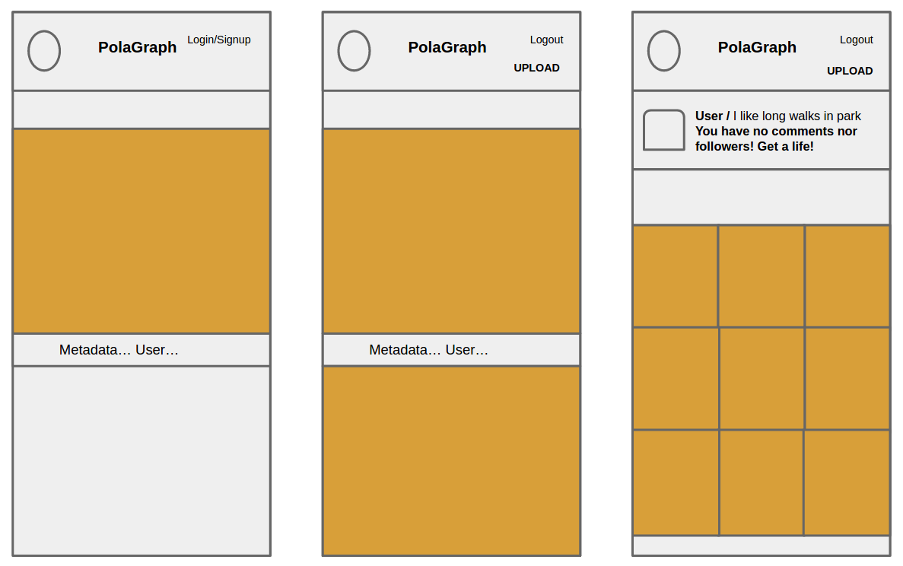
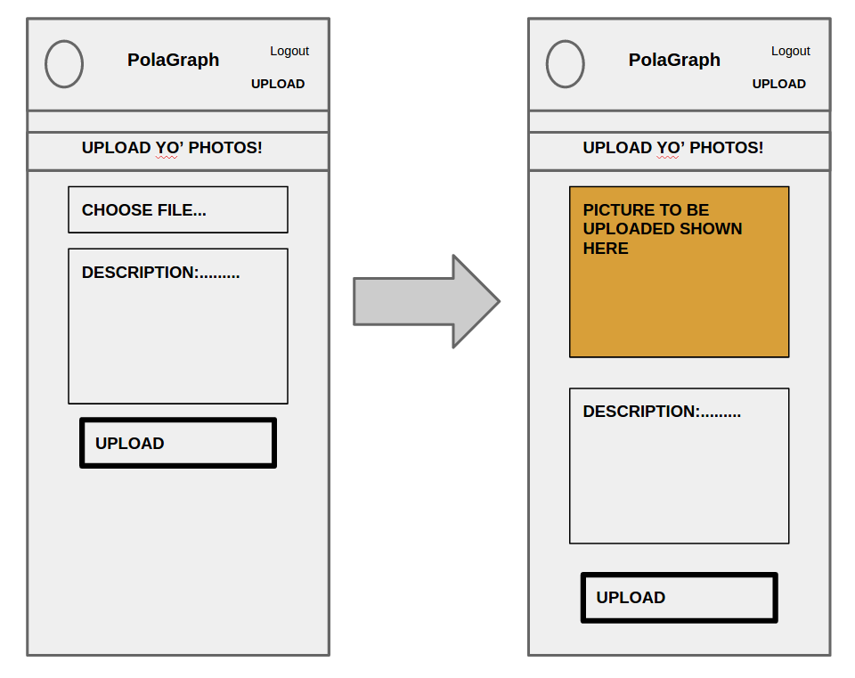

# polagraph

A mobile/web APP to which users can upload their photos. Users need to sign in to upload & comment on them.

Will be hosted on Heroku eventually (estimated date of online launch 18.6.2015).

##How to use?

Out polagraph should be online at Heroku by Thursday 18.6.2015.
But until then:

#APP specs

+ [ ] Storage:
  + [ ] Images Amazon s3
  + [ ] Everything else Mongo DB
+ [ ] Authentication:
  + [ ] Using a 3rd party authentication
  + [ ] Stretch goal own login (hashing pw's etc)
+ [ ] Image Upload
+ [ ] Image View
+ [ ] Image Delete
+ [ ] Image comment
+ [ ] Email alerting
  + [ ] Signup
  + [ ] Daily digest
+ [ ] Data analysis
  + [ ] Setting up data log
  + [ ] Decide what we want to analyze

#### TO DO LIST
@ Pivotal tracker-> User stories & Epics & ToDoList

### Wireframes

##How?

WDD -> Wine driven development
RDD -> ReadMe driven development
TDD -> Test driven development
