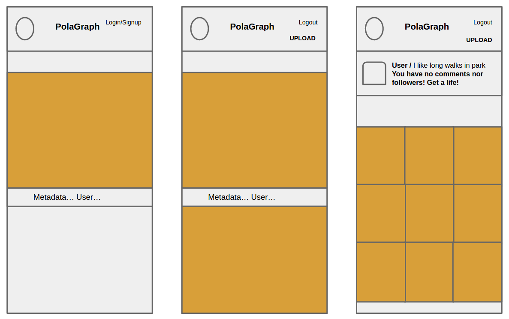
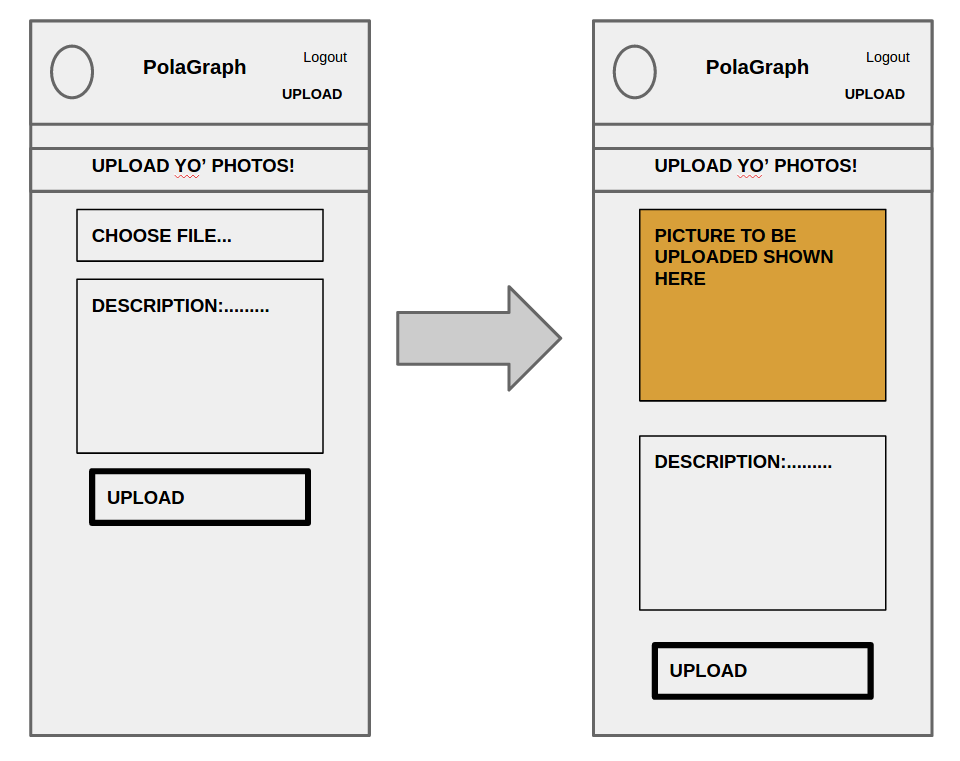

# polagraph

A mobile/web APP to which users can upload their photos. Users need to sign in to upload & comment on them.

Polagraph now live on heroku: [Polagraph](https://arcane-beyond-4724.herokuapp.com/)

##How to use?

Go to: [Polagraph](https://arcane-beyond-4724.herokuapp.com/)
-> Log in using your Google account -> and start uploading pictures!

#APP specs

+ [ ] Storage:
  + [ ] Images Amazon s3
  + [ ] Everything else Mongo DB
+ [ ] Authentication:
  + [ ] Using a 3rd party authentication
  + [ ] Stretch goal own login (hashing pw's etc)
+ [ ] Image Upload
+ [ ] Image View
+ [ ] Image Delete
+ [ ] Image comment
+ [ ] Email alerting
  + [ ] Signup
  + [ ] Daily digest
+ [ ] Data analysis
  + [ ] Setting up data log
  + [ ] Decide what we want to analyze

#### TO DO LIST
@ Pivotal tracker-> User stories & Epics & ToDoList

##How?

WDD -> Wine driven development

RDD -> ReadMe driven development

TDD -> Test driven development

##What we be using?
The kickass framework of the week is  **HAPI JS** (http://hapijs.com/)

-3rd party authentication with hapi plugin-> **bell**
(https://github.com/hapijs/bell)

-Cookie based session management with bell to enable multiple pages-> (https://github.com/hapijs/hapi-auth-cookie)

-Data collection to logs _[to enable data analysis]_ with hapi plugin->**good** (https://github.com/hapijs/good)

-Emailing delivery API -> **Mandrill** (http://mandrill.com/)  

### Wireframes

